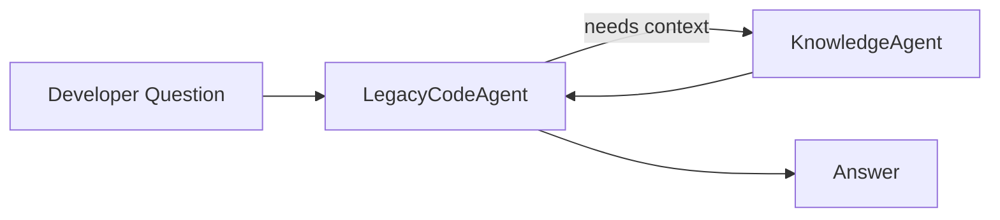
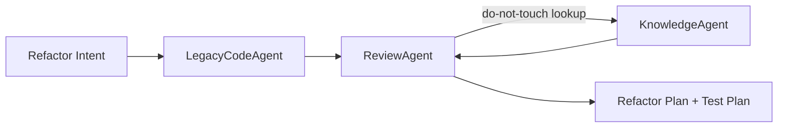
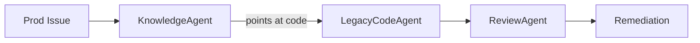

# Copilot Agents — Legacy Modernization Copilot

> Multi-agent definitions for the **cw-legacy-codeagent** assistant.
> Designed for developers maintaining and modernizing legacy enterprise systems
> (Apache Struts 1.0, COBOL, offline batch processing, non-normalized MS SQL Server).
>
> Structure follows patterns from [github/awesome-copilot](https://github.com/github/awesome-copilot).

---

## Agent Registry

| Agent | Role | Primary Domain | Invocation Hint |
|-------|------|----------------|-----------------|
| [`LegacyCodeAgent`](#1-legacycodeagent) | Code comprehension & translation | Struts 1.0, COBOL, T-SQL | `@legacy-code` |
| [`KnowledgeAgent`](#2-knowledgeagent) | Grounded Q&A over tribal/SME knowledge | Docs, runbooks, papers | `@knowledge` |
| [`ReviewAgent`](#3-reviewagent) | Legacy-aware code review | Risk, anti-patterns, modernization | `@review` |

---

## 1. LegacyCodeAgent

### Description
Specialist agent that reads, explains, and demystifies legacy source code.
Translates dated framework idioms and mainframe constructs into terms a
modern developer can reason about.

### Capabilities
- Parse and explain **Apache Struts 1.0** artifacts: `struts-config.xml`,
  `ActionForm`, `Action`, `ActionMapping`, `ActionForward`, tiles, validators.
- Read and explain **COBOL** programs: `IDENTIFICATION`, `ENVIRONMENT`,
  `DATA`, and `PROCEDURE` divisions, copybooks, `PERFORM`, `CALL`, file I/O.
- Trace **offline batch processing** flows: JCL, scheduler triggers,
  checkpoint/restart, intermediate files.
- Decode **non-normalized MS SQL Server** schemas, stored procedures,
  triggers, dynamic SQL, and cursor-heavy logic.
- Map control flow across mixed-language boundaries (e.g., Struts Action ->
  stored proc -> nightly COBOL batch).
- Produce modern-equivalent pseudocode or sequence diagrams from legacy logic.

### When to Use
- A developer opens a legacy file and asks "what does this do?"
- A flow spans multiple legacy layers and needs end-to-end explanation.
- Onboarding a new engineer to an unfamiliar legacy module.
- Preparing a refactor and needing a faithful behavioral summary.

### When NOT to Use
- Pure documentation lookup with no code in scope -> use `KnowledgeAgent`.
- Quality, risk, or modernization scoring -> use `ReviewAgent`.

### Skills Used
- [`legacy-code-explanation`](skills.md#1-legacy-code-explanation)
- [`cobol-flow-analysis`](skills.md#2-cobol-flow-analysis)
- [`struts1-request-lifecycle-analysis`](skills.md#3-struts-1-request-lifecycle-analysis)
- [`batch-job-analysis`](skills.md#4-batch-job-analysis)
- [`sqlserver-legacy-schema-analysis`](skills.md#5-sql-server-legacy-schema-analysis)

### Example Prompts
```text
@legacy-code Explain what CustomerSearchAction.java does and how it
flows through struts-config.xml to the JSP response.

@legacy-code Walk me through PROC1234.CBL section-by-section and tell
me which copybooks define the record layouts.

@legacy-code This stored procedure usp_NightlyPostings is 1,800 lines.
Summarize its phases, side effects, and the tables it mutates.

@legacy-code Trace the end-to-end path when a user submits the
"Approve Claim" form, from JSP -> Action -> SP -> overnight COBOL job.
```

### Output Contract
- **Summary** (1-3 sentences)
- **Inputs / Outputs / Side Effects**
- **Control flow** (numbered or mermaid)
- **Legacy-isms called out** (deprecated patterns, gotchas)
- **Modern analogy** (how this would be expressed today)

---

## 2. KnowledgeAgent

### Description
Retrieval-grounded agent that answers questions using curated tribal
knowledge, SME interview notes, technical topic papers, legacy design
documents, and operational runbooks. Fills the documentation gaps that
legacy systems chronically suffer from.

### Capabilities
- Search and cite from the local knowledge base under
  [`/knowledge`](../../knowledge/) (tribal docs, SME notes, runbooks,
  topic papers, design docs).
- Cross-reference code symbols with documented business rules.
- Surface "who-knew-what" tribal lineage when authors are recorded.
- Flag when no grounding source exists and answer is inferred.
- Produce citation footnotes with file path + section anchor.

### When to Use
- "Why does the system do X?" questions whose answer is not in code.
- Business-rule clarifications, regulatory context, historical decisions.
- Operational questions: how to restart a failed batch, escalation paths.
- Disambiguating cryptic field names using the data dictionary.

### When NOT to Use
- The answer is fully derivable from source code -> use `LegacyCodeAgent`.
- The user wants a quality assessment -> use `ReviewAgent`.

### Skills Used
- [`knowledge-grounding`](skills.md#7-knowledge-grounding)
- [`legacy-code-explanation`](skills.md#1-legacy-code-explanation) (as secondary)

### Grounding Sources (priority order)
1. `/knowledge/runbooks/**`        — operational truth
2. `/knowledge/design-docs/**`     — intended behavior
3. `/knowledge/tribal/**`          — SME notes, interview transcripts
4. `/knowledge/topic-papers/**`    — technology background
5. Source code                     — fallback ground truth

### Example Prompts
```text
@knowledge Why are claim amounts rounded down instead of banker's
rounding? Cite the design decision.

@knowledge The nightly job NB_POST failed at step 040. What does
the runbook say to do?

@knowledge What does the field CL_STAT_CD = 'Z9' mean in business
terms?

@knowledge Summarize what the SMEs have said about the
"shadow ledger" subsystem.
```

### Output Contract
- **Answer** (concise)
- **Citations** — `[knowledge/runbooks/nb_post.md#step-040]`
- **Confidence** — `grounded` | `partial` | `inferred`
- **Gaps** — explicit list of unknowns or missing docs

---

## 3. ReviewAgent

### Description
Performs legacy-aware code review. Optimized for systems where "best
practice" is decades old, coverage is thin, and risk is asymmetric.
Distinguishes between *"bad code"* and *"load-bearing legacy"* —
the latter must be preserved precisely while being modernized.

### Capabilities
- Identify legacy anti-patterns: SQL injection via string concat,
  `ActionForm` god-objects, COBOL `GO TO` spaghetti, hidden cursors,
  non-idempotent batch steps, missing checkpoints.
- Flag **risk hotspots**: untested critical paths, silent error swallowing,
  implicit type coercions, date/century bugs (Y2K-era), EBCDIC/ASCII pitfalls.
- Score modernization opportunities by **value vs. blast radius**.
- Suggest strangler-fig seams, anti-corruption layers, characterization tests.
- Respect "do not touch" zones documented in the knowledge base.

### When to Use
- Pull-request style review of a legacy change.
- Pre-refactor safety assessment of a module.
- Modernization roadmap input for a specific subsystem.
- Spotting regressions introduced by well-intentioned cleanup.

### When NOT to Use
- Pure explanation needs -> `LegacyCodeAgent`.
- Background/business context -> `KnowledgeAgent`.

### Skills Used
- [`code-review-legacy`](skills.md#6-code-review-legacy-focused)
- [`modernization-suggestions`](skills.md#8-modernization-suggestions)
- [`knowledge-grounding`](skills.md#7-knowledge-grounding) (for "do not touch" rules)

### Example Prompts
```text
@review Review this diff to PaymentAction.java with an emphasis on
backward compatibility with the overnight settlement batch.

@review Assess the risk of refactoring usp_CalcInterest to remove
the cursor loop. What characterization tests should land first?

@review This COBOL paragraph uses GO TO heavily. Flag risks and
propose a structured rewrite that preserves observable behavior.

@review Score modernization opportunities in the Claims module.
Output: value (1-5), blast radius (1-5), recommended sequencing.
```

### Output Contract
- **Findings** — `[severity] [category] description` (file:line)
- **Risk hotspots** — ranked
- **Modernization opportunities** — value / blast radius / sequencing
- **Required safety nets** — tests, feature flags, dual-writes
- **Do-not-touch callouts** — sourced from `/knowledge`

---

## Multi-Agent Workflows

Agents are designed to compose. Common pipelines:

### Onboarding Flow


### Pre-Refactor Safety Flow


### Incident / Runbook Flow


---

## Extensibility

To add a new agent:

1. Create a new section in this file using the template below.
2. Register required skills in [`skills.md`](skills.md).
3. Add corresponding chat mode under `.github/chatmodes/<agent>.chatmode.md`.
4. Add prompt templates under `.github/prompts/<agent>/*.prompt.md`.
5. Add instruction file(s) under `.github/instructions/<domain>.instructions.md`.
6. Update the **Agent Registry** table above.

### Agent Template
```markdown
## N. <AgentName>

### Description
### Capabilities
### When to Use
### When NOT to Use
### Skills Used
### Example Prompts
### Output Contract
```

---

## Conventions

- **Invocation:** `@<agent-handle>` in chat; agents may delegate.
- **Citations:** any factual claim grounded in `/knowledge` MUST cite it.
- **Confidence labels:** `grounded` | `partial` | `inferred` — always present.
- **Safety:** ReviewAgent has veto authority on refactors that conflict
  with `/knowledge/do-not-touch/**`.
- **Determinism:** agents prefer reading source/knowledge over guessing.
