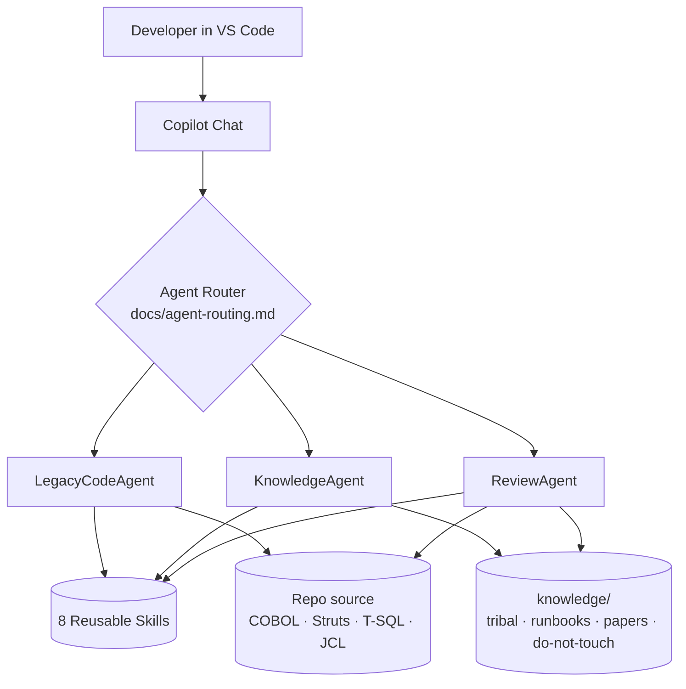

<div align="center">

# cw-legacy-codeagent

### The Legacy Code AI Assistant

**A GitHub Copilot–powered, multi-agent assistant that reads COBOL, Struts 1, and legacy SQL Server — and grounds every answer in the tribal knowledge most enterprises are about to lose.**

[Features](#-features) ·
[Demo (3 min)](#-3-minute-demo) ·
[Architecture](#-architecture) ·
[Get started](#-get-started) ·
[Roadmap](#-roadmap)

<sub>Structure follows <a href="https://github.com/github/awesome-copilot">github/awesome-copilot</a> conventions.</sub>


</div>

---

## Washington State AI Code Camp Update

This repository includes an enhanced standalone pitch page at [`index.html`](index.html) and a Word-friendly pitch draft at [`docs/pitch/wa-ai-code-camp-pitch-deck.txt`](docs/pitch/wa-ai-code-camp-pitch-deck.txt).

> This project will be added to the Awesome GitHub Copilot Project list: **https://awesome-copilot.github.com**

The original uploaded archive and original standalone HTML are preserved under [`original-uploads/`](original-uploads/) for traceability.

## The Problem

Enterprise engineering is sitting on a generational cliff:

- **220+ billion lines of COBOL** still run the world's payments, claims, benefits, and tax systems. *(IBM, Reuters)*
- **65%+ of large enterprises** still depend on at least one Struts 1.x application — most of them past end-of-life.
- **Mainframe and legacy SMEs are retiring faster than they can be replaced.** Median age of a working COBOL engineer is over 55. The knowledge walks out the door.
- **Documentation is missing, stale, or contradictory.** What survives lives in PDFs, Confluence graveyards, and Slack DMs from 2014.
- **Tight coupling** between web apps, stored procedures, and overnight batch jobs makes every change asymmetric: a 5-line patch can blow up a $40M nightly run.

Modern AI tools were trained on GitHub. **GitHub doesn't have your COBOL.** And it definitely doesn't have your tribal knowledge.

The result: developers can't safely change what they don't understand, and senior SMEs become the bottleneck for every refactor, audit, and modernization.

---

## The Solution

`cw-legacy-codeagent` is a **multi-agent GitHub Copilot assistant** purpose-built for legacy enterprise stacks. It:

1. **Reads** Apache Struts 1.0, COBOL, JCL, non-normalized MS SQL Server, T-SQL stored procedures, JSPs, and copybooks.
2. **Grounds** every answer in a curated `/knowledge` base — tribal docs, technical papers, runbooks, design docs.
3. **Reviews** legacy code with a risk lens that distinguishes "bad code" from "load-bearing legacy" — and enforces `do-not-touch` invariants.
4. **Plans** incremental modernization (strangler-fig seams, characterization tests, phased rollouts) instead of suggesting big-bang rewrites.
5. **Cites** every grounded claim and labels every answer with a `grounded | partial | inferred` confidence — so the output is **auditable**, not just plausible.

> **One sentence:** turn impenetrable legacy code + a retiring SME's notebook into reviewable, citable, change-ready insight — inside VS Code.

---

## ✨ Features

- 🤖 **Three specialized agents** that collaborate:
  - [`LegacyCodeAgent`](.github/copilot/copilot-agents.md#1-legacycodeagent) — explains and traces legacy source.
  - [`KnowledgeAgent`](.github/copilot/copilot-agents.md#2-knowledgeagent) — grounds answers in `/knowledge` with citations.
  - [`ReviewAgent`](.github/copilot/copilot-agents.md#3-reviewagent) — legacy-aware code review with veto on `do-not-touch` violations.
- 🧩 **8 reusable skills** — COBOL flow analysis, Struts 1 lifecycle, batch job analysis, SQL Server schema analysis, knowledge grounding, modernization scoring, and more. See [skills.md](.github/copilot/skills.md).
- 📚 **Grounded answers with citations** — every factual claim links back to `knowledge/tribal`, `knowledge/runbooks`, or `knowledge/technical-papers`.
- 🧠 **Tribal knowledge as a first-class asset** — YAML-headered, taggable, queryable, promotable. See [docs/grounding.md](docs/grounding.md).
- 🛑 **`do-not-touch` enforcement** — the `ReviewAgent` cannot recommend changes that violate documented invariants.
- 🧭 **Deterministic agent routing** — published rules and a flowchart, not a black box. See [docs/agent-routing.md](docs/agent-routing.md).
- 📝 **Copy-paste prompt templates** for every common workflow. See [prompts/](prompts/).
- 🧪 **Realistic demo artifacts** — a 28-year-old COBOL nightly batch, a Struts 1 Approve Claim flow, and a non-normalized SQL Server schema in [examples/](examples/).
- 🪶 **Zero infra to install** — just GitHub Copilot Chat in VS Code. Conventions follow [github/awesome-copilot](https://github.com/github/awesome-copilot).

---

## 🎬 3-Minute Demo

> Full script: [docs/demo-script.md](docs/demo-script.md).

### Demo 1 — Explain a 28-year-old COBOL batch with grounded tribal knowledge

**Open:** [examples/cobol/NB_POST.CBL](examples/cobol/NB_POST.CBL)
**Prompt:**
```
@legacy-code Explain examples/cobol/NB_POST.CBL end-to-end.
Use prompts/explain-cobol.md as the output contract.
Pull tribal context from /knowledge/tribal for magic status codes
('A','R','H','Z9') and cite every grounded claim.
```
**Watch for:** the magic-code table where `Z9` is cited directly from
[knowledge/tribal/nb-post-z9-special-hold.md](knowledge/tribal/nb-post-z9-special-hold.md) — and the `Gaps` section that tells you what knowledge is still missing.


---

### Demo 2 — Catch a cross-layer risk before it ships

**Open:** [examples/struts/.../ApproveClaimAction.java](examples/struts/src/main/java/com/example/legacy/billing/action/ApproveClaimAction.java)
**Prompt:**
```
@review Review examples/struts/.../ApproveClaimAction.java and the SP
it calls (examples/sql/usp_PostClaimApproval.sql).
Use prompts/review-legacy-code.md. Lenses: security, correctness,
backward-compat with NB_POST_NIGHTLY. Honor /knowledge/do-not-touch.
```
**Watch for:** `[blocker] [security] SQL injection`, `[blocker] [security] Hard-coded credentials`, `[major] [correctness] No transaction boundary`, **and** an explicit statement that the `Z9` invariant was NOT violated — because the agent checked `/knowledge`.


---

### Demo 3 — Make sense of a non-normalized schema in 20 seconds

**Open:** [examples/sql/schema.sql](examples/sql/schema.sql)
**Prompt:**
```
@legacy-code Analyze examples/sql/schema.sql.
Use prompts/analyze-sql-schema.md. Focus on BILLING.CLAIM: column
dictionary, implicit FKs, overloaded ROUTING_FLAGS, and ranked
normalization opportunities that honor /knowledge/do-not-touch.
```
**Watch for:** inferred foreign keys that were never declared, the `ROUTING_FLAGS` bitfield decoded, and a value-vs-blast-radius ranking you can drop straight into a roadmap.


---

## 🏛 Architecture




**Three layers, one assistant:**

| Layer | What it does | Where it lives |
|-------|--------------|----------------|
| **Agents** | Role-specialized personas that compose into workflows. | [`.github/copilot/copilot-agents.md`](.github/copilot/copilot-agents.md) |
| **Skills** | Reusable, deterministic capabilities (COBOL flow, Struts lifecycle, SQL schema, review, grounding…). | [`.github/copilot/skills.md`](.github/copilot/skills.md) |
| **Knowledge** | Tribal docs, runbooks, technical papers, design docs, `do-not-touch` invariants — all YAML-headered and citable. | [`knowledge/`](knowledge/) + [docs/grounding.md](docs/grounding.md) |

Routing rules and worked workflows (COBOL → explain + ground, SQL → analyze + review, incident → runbook → code) are documented in **[docs/agent-routing.md](docs/agent-routing.md)**.


### Why this design wins

- **Auditable, not just plausible.** Every grounded claim is cited. Every answer carries a `grounded | partial | inferred` confidence label. Compliance loves it.
- **Composable.** Adding a new legacy stack = adding a skill + a knowledge folder + (optionally) an agent. Pattern documented.
- **Safe by default.** Behavior preservation is the default. `do-not-touch` has veto power. No big-bang rewrites recommended.
- **Knowledge becomes a flywheel.** Every `Gap` the assistant reports is a prompt to promote tribal knowledge into the repo — where it grounds the next answer.

---

## 🚀 Get started

**Prerequisites**
- VS Code with **GitHub Copilot** + **GitHub Copilot Chat** extensions, signed in.
- Workspace context enabled in Copilot Chat (so it can read `.github/copilot/` and `knowledge/`).

**Try it in 60 seconds**

```powershell
git clone https://github.com/nprasann/cw-legacy-codeagent.git
cd cw-legacy-codeagent
code .
```

Open the Copilot Chat panel and run **Demo 1** above. Then read:

1. [docs/usage.md](docs/usage.md) — developer usage guide.
2. [docs/architecture.md](docs/architecture.md) — full system design.
3. [docs/grounding.md](docs/grounding.md) — how to add tribal knowledge.
4. [docs/agent-routing.md](docs/agent-routing.md) — how the agents collaborate.
5. [prompts/](prompts/) — copy-paste templates for every workflow.

---

## 📁 Repository layout

```
cw-legacy-codeagent/
├── .github/copilot/          # agents + skills (the brain)
│   ├── copilot-agents.md
│   └── skills.md
├── docs/                     # design + usage docs
│   ├── architecture.md
│   ├── agent-routing.md
│   ├── grounding.md
│   ├── usage.md
│   └── demo-script.md        # 3-minute hackathon script
├── knowledge/                # the grounded knowledge base
│   ├── tribal/
│   ├── technical-papers/
│   ├── runbooks/
│   └── (do-not-touch/, design-docs/, sme-notes/ — optional)
├── examples/                 # realistic legacy demo artifacts
│   ├── cobol/                # NB_POST.CBL + copybooks + JCL
│   ├── struts/               # Approve Claim flow (Action, Form, config, JSP)
│   └── sql/                  # non-normalized BILLING schema + stored procs
├── prompts/                  # copy-paste prompt templates
│   ├── explain-cobol.md
│   ├── analyze-batch.md
│   ├── explain-struts.md
│   ├── review-legacy-code.md
│   └── analyze-sql-schema.md
├── src/                      # placeholder for future tooling
├── LICENSE
└── README.md
```

---

## 🛣 Roadmap

> **Now (shipped in this repo)** — multi-agent design, skills catalog, grounding conventions, prompt templates, demo artifacts, routing rules, 3-minute demo script.

### Next 30 days
- [ ] **`KnowledgeIngestor` skill** — drop a PDF / Confluence export / Word doc into `/knowledge/inbox` and have it normalized into headered Markdown with auto-tagged metadata.
- [ ] **`do-not-touch/` seeded folder** with worked examples and a `ReviewAgent` self-test.
- [ ] **`design-docs/` and `sme-notes/`** subfolders + templates.
- [ ] **Hackathon screenshots** in [docs/images](docs/images/).
- [ ] **Chat modes / instructions / prompts** wired under `.github/chatmodes/`, `.github/instructions/`, `.github/prompts/` (full awesome-copilot surface).

### Next 90 days
- [ ] **Static analyzers** under [`src/analyzers/`](src/) — Struts 1 graph extractor, COBOL `PERFORM/CALL` extractor, T-SQL dependency walker — that auto-feed `KnowledgeAgent`.
- [ ] **Characterization-test generator** — `ReviewAgent` produces golden-output tests for any legacy unit it flags as load-bearing.
- [ ] **Modernization brief generator** — one-click "strangler-fig roadmap" PDF from a single `@review` invocation.
- [ ] **Multi-repo grounding** — point `KnowledgeAgent` at a federation of repos for org-wide tribal recall.

### Beyond
- [ ] **`MainframeAgent`** for VSAM, DB2, IMS, CICS contexts.
- [ ] **`DataAgent`** for ETL graveyards (SSIS, DataStage, Informatica).
- [ ] **Voice-mode SME capture** — record an SME interview, auto-promote to `knowledge/tribal/` with citations.
- [ ] **GitHub Actions integration** — `ReviewAgent` posts findings on every PR; missing knowledge gets opened as auto-issues.
- [ ] **VS Code extension** that surfaces the agent router, knowledge graph, and citation panel inline.

---

## 🤝 Contributing knowledge

The fastest way to make the assistant smarter is to add knowledge:

1. Pick a folder under [`knowledge/`](knowledge/).
2. Use kebab-case filenames prefixed by subsystem.
3. Add the YAML metadata header from [docs/grounding.md §3](docs/grounding.md#3-metadata-header-required).
4. Open a PR — the `ReviewAgent` will sanity-check structure and metadata.

Every `Gap` an agent reports is an invitation. Promote, cite, repeat.

---

## 📜 License

See [LICENSE](LICENSE).

---

<div align="center">

**`cw-legacy-codeagent`** — legacy isn't bad code, it's load-bearing code.
Make it readable, reviewable, and ready for the next 20 years.

</div>
