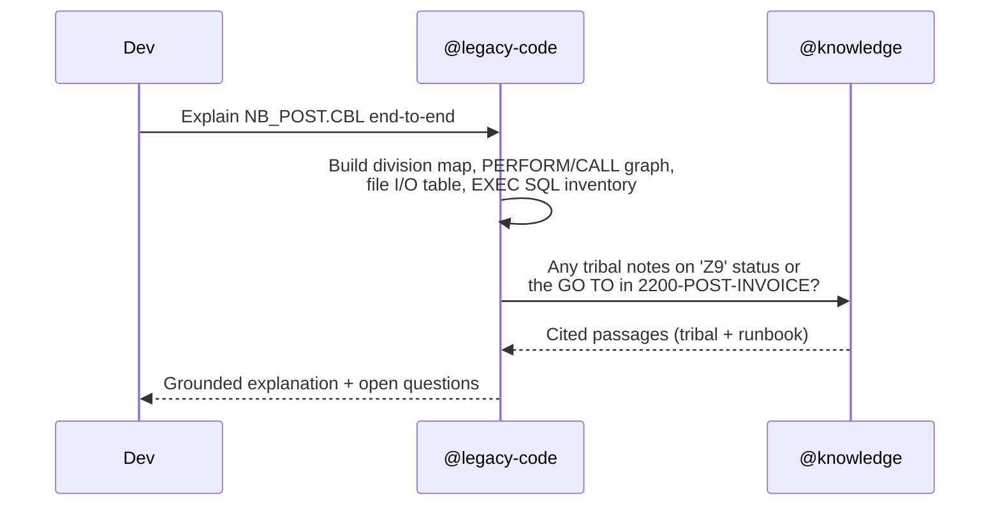
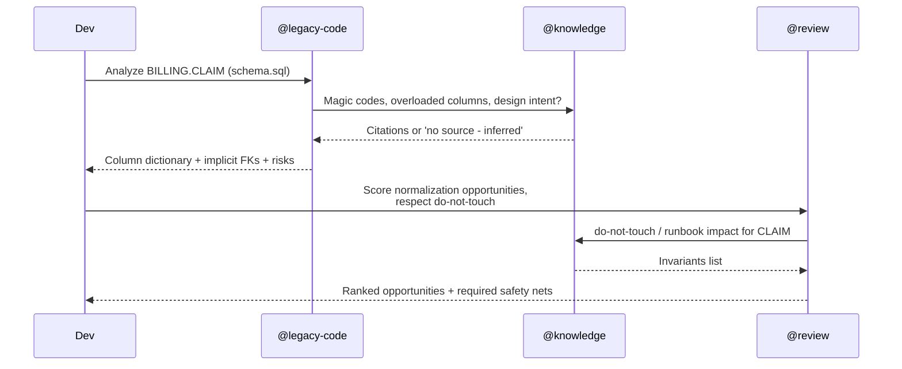
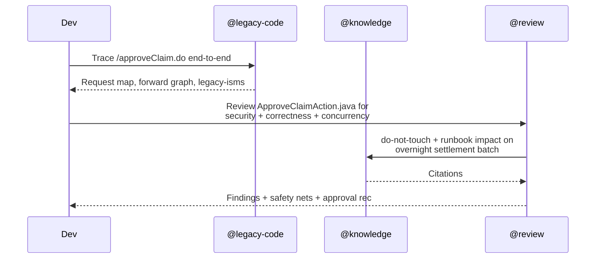
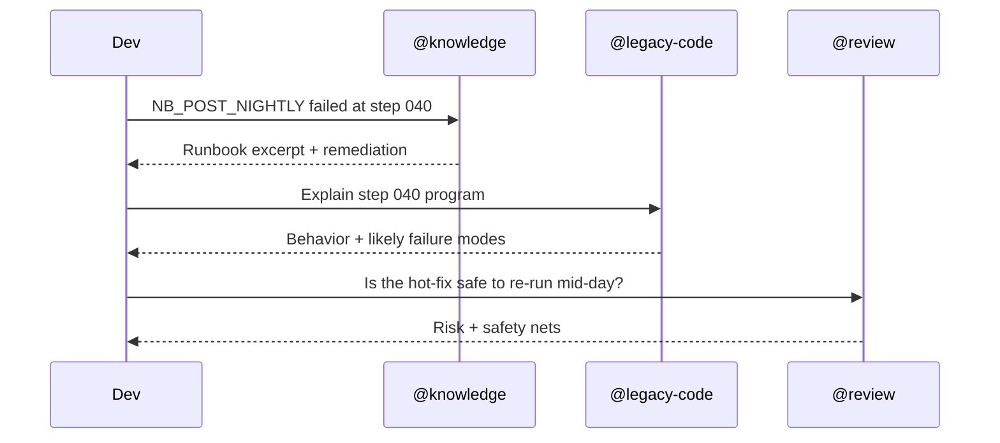
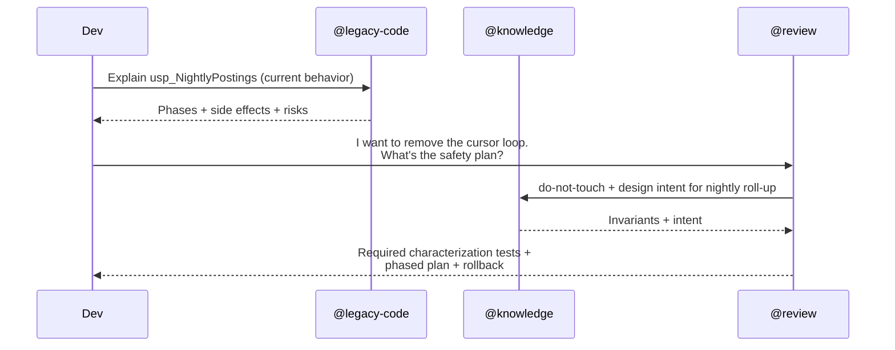

# Agent Routing

> How the **cw-legacy-codeagent** assistant routes a developer request to one
> or more agents — and how those agents collaborate. Practical and actionable:
> built so a developer or a higher-level orchestrator can pick the right agent
> without reading the full architecture doc.

Related: [architecture.md](./architecture.md) · [grounding.md](./grounding.md) ·
[usage.md](./usage.md) · [.github/copilot/copilot-agents.md](../.github/copilot/copilot-agents.md)

---

## 1. Agent Cheat Sheet

| Agent | Handle | When to use | Do NOT use when |
|-------|--------|-------------|-----------------|
| **LegacyCodeAgent** | `@legacy-code` | You need to **understand or trace** legacy source — Struts 1 Actions, COBOL programs, JCL, T-SQL stored procedures, JSPs, copybooks. | You only want background / business context (use `@knowledge`) or a quality verdict (use `@review`). |
| **KnowledgeAgent**  | `@knowledge`   | You need **why**, not what. Business rules, historical decisions, runbook steps, magic-code legends, "do not touch" invariants. | The answer is fully derivable from source code (use `@legacy-code`). |
| **ReviewAgent**     | `@review`      | You need a **risk-aware verdict** — diffs, PRs, refactor scoping, modernization opportunities, security/perf/correctness scans. | You only need an explanation (use `@legacy-code`) or operational background (use `@knowledge`). |

---

## 2. Decision Logic

A simple, deterministic router. Use the **first matching rule** top-down.

```
INPUT SIGNAL                                       ROUTE TO
─────────────────────────────────────────────────────────────────────────
Diff, PR, "review this", "is this safe to merge",
"score modernization", "blast radius"           →  @review
                                                   (will delegate to others)

File extension ∈ {.CBL, .cpy, .JCL}              →  @legacy-code
Code shape: Struts Action/ActionForm,
struts-config.xml, web.xml, *.do, JSP            →  @legacy-code
Code shape: T-SQL DDL, stored proc, trigger,
schema.sql, usp_*                                →  @legacy-code

Question starts with "why", "what does X mean",
"how do we recover", "what is the runbook for"   →  @knowledge
Magic code lookup (e.g., 'Z9', CUST_FLAGS bit)   →  @knowledge
"Find the design doc / SME note / runbook for…"  →  @knowledge

Otherwise (mixed signal, unclear scope)          →  @legacy-code
                                                   (it will pull @knowledge
                                                    as needed)
```

### Quick file-type → agent map

| File / artifact | Primary agent |
|-----------------|---------------|
| `examples/cobol/*.CBL`, `*.cpy`, `*.JCL` | `@legacy-code` |
| `examples/struts/**/*.java`, `struts-config.xml`, `validation.xml`, `*.jsp` | `@legacy-code` |
| `examples/sql/schema.sql`, `usp_*.sql`, triggers | `@legacy-code` |
| `knowledge/tribal/**`, `runbooks/**`, `technical-papers/**` | `@knowledge` |
| Unified diff / pull request | `@review` |
| `do-not-touch/**` lookup | `@knowledge` (consumed by `@review`) |

---

## 3. Routing Flowchart

```mermaid
flowchart TD
  Q[Developer request] --> A{Diff / PR / 'review'?}
  A -- yes --> RA[@review]
  A -- no --> B{Legacy source file<br/>COBOL · Struts · T-SQL?}
  B -- yes --> LCA[@legacy-code]
  B -- no --> C{Why / what-does-it-mean<br/>/ runbook / SME?}
  C -- yes --> KA[@knowledge]
  C -- no --> LCA

  RA -- needs explanation --> LCA
  RA -- needs invariants / intent --> KA
  LCA -- needs context --> KA
  KA -- points at code --> LCA
```

---

## 4. Collaboration Contracts

Agents call each other through three patterns. Keep them explicit so the
orchestrator stays predictable.

| Pattern | From → To | Purpose | Required handoff |
|---------|-----------|---------|------------------|
| **Enrich** | `@legacy-code` → `@knowledge` | Add intent / history to a code explanation. | File path(s) + symbol(s) under discussion. |
| **Verify** | `@review` → `@knowledge` | Check `do-not-touch`, design intent, runbook impact. | List of files/lines and the proposed change summary. |
| **Explain** | `@review` → `@legacy-code` | Get a plain-language walkthrough of a flagged section. | File + line range; reason it was flagged. |

Every cross-agent response MUST include:

- **Confidence**: `grounded | partial | inferred`
- **Citations**: `[knowledge/<folder>/<file>.md#<anchor>]` for any grounded claim
- **Gaps**: explicit list of unknowns

---

## 5. Example Workflows

### 5.1 COBOL → Explanation + Knowledge Grounding
**Goal:** a developer opens `examples/cobol/NB_POST.CBL` and asks
"what does this do, and why?"



**Prompt skeleton**
```
@legacy-code Explain examples/cobol/NB_POST.CBL end-to-end.
Pull any tribal / runbook context via @knowledge for magic codes
('A','R','H','Z9') and the preserved GO TO branch.
Use prompts/explain-cobol.md as the output contract.
```

Expected output: sections 1–12 from
[prompts/explain-cobol.md](../prompts/explain-cobol.md), with
`Confidence` and `Gaps`.

---

### 5.2 SQL → Schema Analysis + Risk Review
**Goal:** sense-make a non-normalized table and decide if a proposed
refactor is safe.



**Prompt skeleton**
```
Step 1:
@legacy-code Analyze examples/sql/schema.sql for BILLING.CLAIM.
Use prompts/analyze-sql-schema.md as the output contract.

Step 2:
@review Using the analysis above, score normalization opportunities
for BILLING.CLAIM. Honor /knowledge/do-not-touch.
Use prompts/review-legacy-code.md sections 7–10.
```

---

### 5.3 Struts Request → Trace + Review
**Goal:** understand the Approve Claim flow and assess the security risk.



**Prompt skeleton**
```
@legacy-code Trace /approveClaim.do using prompts/explain-struts.md.

@review Review examples/struts/.../ApproveClaimAction.java using
prompts/review-legacy-code.md. Lenses: security, correctness,
backward-compat with the overnight settlement batch.
```

---

### 5.4 Incident / Runbook Triage
**Goal:** a batch failed; figure out what to do.



**Prompt skeleton**
```
@knowledge NB_POST_NIGHTLY failed at step 040. Pull the runbook
and propose next steps.

@legacy-code Walk me through the program at step 040.

@review Assess risk of re-running mid-day with SKIPCNT override.
```

---

### 5.5 Pre-Refactor Safety Brief
**Goal:** scope a refactor before touching code.



---

## 6. Orchestration Rules

Hard rules every workflow MUST follow.

1. **One agent owns the response.** Even when several contribute, exactly
   one agent produces the final answer to the developer.
2. **Skills do not call agents.** Skills are leaf-level; only agents
   compose other agents.
3. **`@review` has veto authority** on any recommendation that violates
   `/knowledge/do-not-touch/**`.
4. **Citations are mandatory** for any claim sourced from `/knowledge`.
5. **Confidence label is mandatory** on every final answer.
6. **Behavior preservation is the default.** Behavior-changing
   recommendations must be explicitly opted into by the developer.
7. **Promote inferences to knowledge.** If an agent infers something
   useful that is not in `/knowledge`, the developer (with SME) should
   create the file per
   [grounding.md §8](./grounding.md#8-promotion-workflow).

---

## 7. Fallbacks & Ambiguity

| Situation | Default behavior |
|-----------|------------------|
| Request is ambiguous between explanation and review | Route to `@legacy-code`; it asks one clarifying question, then proceeds. |
| `/knowledge` is empty for the topic | `@knowledge` answers `inferred` and lists the missing files under Gaps. |
| `@review` finds a pattern that may be intentional | It MUST query `@knowledge` before flagging it as a defect. |
| Multiple agents disagree | The owning agent reconciles, prefers grounded over inferred, and surfaces the disagreement under Gaps. |
| Source code and `/knowledge` conflict | Report both, mark `partial`, recommend an SME promotion. |

---

## 8. Routing Quick Reference (one screen)

```
COBOL / JCL / copybook .............. @legacy-code  (then @knowledge to enrich)
Struts Action / Form / config / JSP . @legacy-code  (then @knowledge to enrich)
T-SQL DDL / SP / trigger ............ @legacy-code  (then @knowledge to enrich)
"Why / what does X mean / runbook" .. @knowledge
Diff / PR / safety / modernization .. @review        (delegates to others)
do-not-touch lookup ................. @knowledge     (consumed by @review)
Unclear .............................. @legacy-code  (it will pull others)
```
