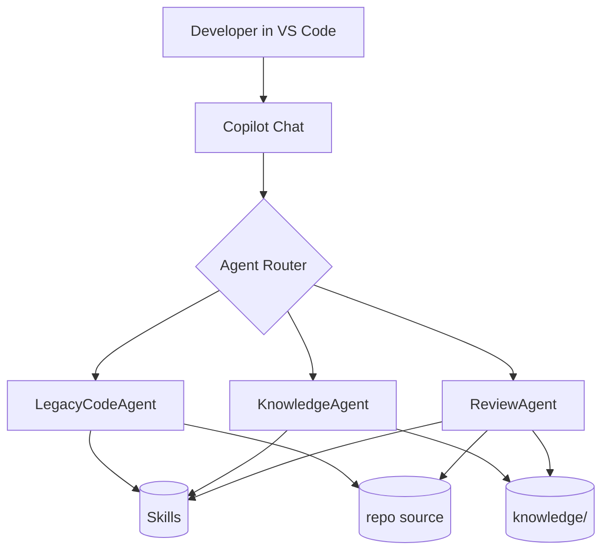
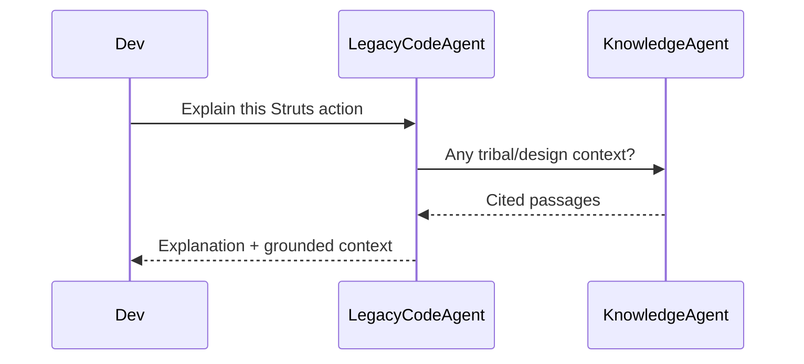
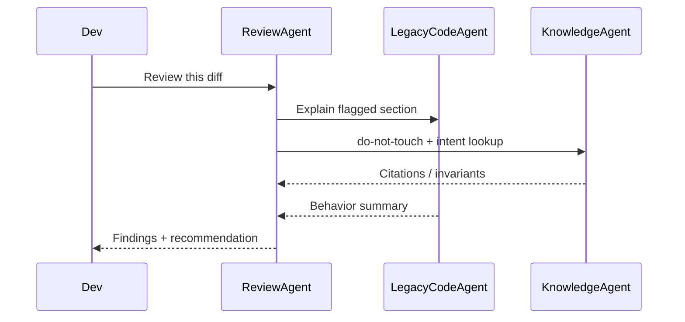
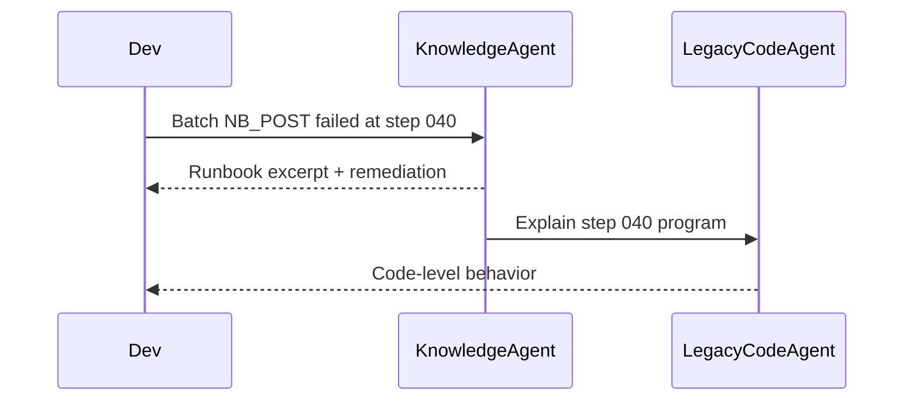

# Architecture — Legacy Code AI Assistant

> Multi-agent design for the **cw-legacy-codeagent** Copilot assistant.
> Aligned with patterns from [github/awesome-copilot](https://github.com/github/awesome-copilot).

---

## 1. System Overview

The assistant is a **multi-agent Copilot system** that helps engineers
understand, review, and modernize legacy enterprise codebases — specifically
Apache Struts 1.0 web apps, COBOL programs, offline batch pipelines, and
non-normalized Microsoft SQL Server schemas.

It is composed of:

- **Agents** — role-specialized personas with clear responsibilities.
- **Skills** — reusable, composable capabilities the agents call.
- **Grounding sources** — curated knowledge under [`/knowledge`](../knowledge/)
  (tribal docs, technical papers, runbooks).
- **Copilot surfaces** — VS Code Copilot Chat backed by the agent and skill
  definitions in [`.github/copilot/`](../.github/copilot/).



---

## 2. Agents

Full definitions live in [`.github/copilot/copilot-agents.md`](../.github/copilot/copilot-agents.md).
Summary:

### 2.1 LegacyCodeAgent
- **Purpose:** explain and demystify legacy source — Struts 1 actions, COBOL
  programs, T-SQL stored procedures, JCL, JSP.
- **Primary inputs:** source files in the repo.
- **Primary outputs:** plain-language explanations, control-flow diagrams,
  modern analogies.
- **Boundary:** does not score quality and does not invent business context.

### 2.2 KnowledgeAgent
- **Purpose:** ground answers in tribal knowledge, SME notes, technical
  papers, design docs, and operational runbooks.
- **Primary inputs:** files under [`/knowledge`](../knowledge/).
- **Primary outputs:** cited passages, synthesized answers, confidence labels,
  gap callouts.
- **Boundary:** never asserts a fact without a citation or an explicit
  `inferred` confidence label.

### 2.3 ReviewAgent
- **Purpose:** legacy-aware code review — anti-patterns, risk hotspots,
  modernization opportunities, safety nets.
- **Primary inputs:** diffs, files, or modules; honors `do-not-touch` entries
  from knowledge.
- **Primary outputs:** findings (`blocker | major | minor | nit`), risk scoring,
  required safety nets, approval recommendation.
- **Boundary:** does not perform raw explanation — delegates to
  `LegacyCodeAgent` when context is needed.

---

## 3. Skills Layer

Skills are reusable units of capability. Full catalog in
[`.github/copilot/skills.md`](../.github/copilot/skills.md).

| # | Skill | Used By |
|---|-------|---------|
| 1 | Legacy Code Explanation | LegacyCodeAgent |
| 2 | COBOL Flow Analysis | LegacyCodeAgent |
| 3 | Struts 1 Request Lifecycle Analysis | LegacyCodeAgent |
| 4 | Batch Job Analysis | LegacyCodeAgent, ReviewAgent |
| 5 | SQL Server Legacy Schema Analysis | LegacyCodeAgent, ReviewAgent |
| 6 | Code Review (Legacy-Focused) | ReviewAgent |
| 7 | Knowledge Grounding | KnowledgeAgent (all) |
| 8 | Modernization Suggestions | ReviewAgent |

Design principles:

- **Composable**: an agent assembles skills per request; skills do not call
  agents.
- **Deterministic shape**: each skill defines an input contract and output
  contract.
- **Citation-aware**: skills that touch `/knowledge` emit citations.

---

## 4. Grounding Layer

The assistant treats `/knowledge` as the system of record for *intent* and
*operational truth*, while source code remains the system of record for
*behavior*.

```
knowledge/
├── tribal/             # SME interviews, oral history, undocumented rules
├── technical-papers/   # background on Struts 1, COBOL, SQL Server patterns
└── runbooks/           # operational procedures, incident playbooks
```

Grounding precedence used by `KnowledgeAgent`:

1. `runbooks/` — operational truth
2. `technical-papers/` — durable technology background
3. `tribal/` — undocumented but authoritative SME knowledge
4. Source code — fallback behavioral ground truth

Conventions for storing documents are defined in
[grounding.md](./grounding.md).

---

## 5. Agent Interaction Patterns

### 5.1 Onboarding Flow


### 5.2 Pull Request Review Flow


### 5.3 Incident / Runbook Flow


---

## 6. Repository Layout

```
cw-legacy-codeagent/
├── .github/
│   └── copilot/
│       ├── copilot-agents.md     # agent personas
│       └── skills.md             # reusable skills
├── docs/
│   ├── architecture.md           # this file
│   ├── grounding.md              # grounding conventions
│   └── usage.md                  # developer usage guide
├── knowledge/
│   ├── tribal/
│   ├── technical-papers/
│   └── runbooks/
├── src/                          # placeholder for future tooling/extensions
├── LICENSE
└── README.md
```

---

## 7. Extensibility

- **Add an agent**: new section in `copilot-agents.md`, update registry, wire
  required skills.
- **Add a skill**: new section in `skills.md`, register in skill table, link
  from consuming agents.
- **Add a knowledge source**: new subfolder under `knowledge/`, follow
  metadata header conventions in [grounding.md](./grounding.md).
- **Add a Copilot surface**: future `.github/chatmodes/`,
  `.github/prompts/`, and `.github/instructions/` directories follow
  awesome-copilot conventions.

---

## 8. Non-Goals

- The assistant does **not** auto-refactor legacy code.
- The assistant does **not** treat its own inferences as documentation —
  human SMEs must promote inferences into `/knowledge`.
- The assistant does **not** bypass `do-not-touch` invariants.
